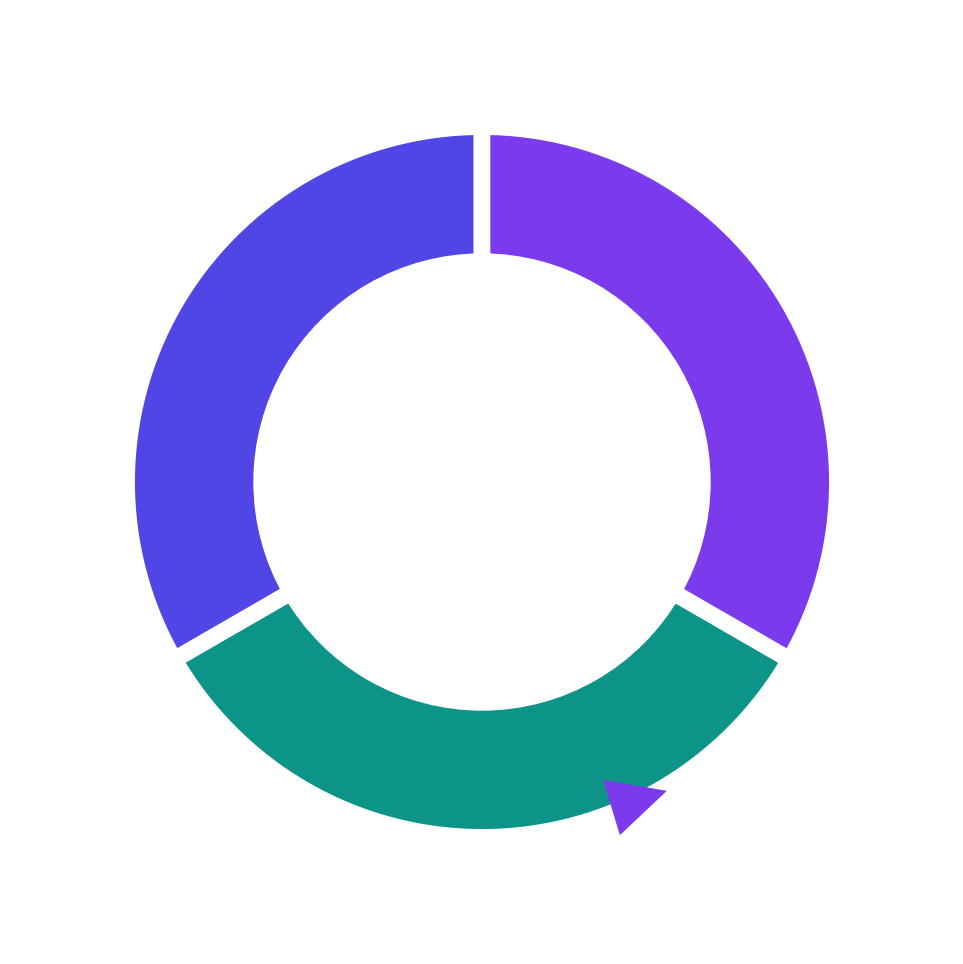

# MetaVibing

**Stop correcting your AI. Start evolving the environment it works in.**

Your AI makes a mistake. You correct it. Next week, it makes the same mistake again.

MetaVibing turns a valuable correction into a persistent Rule, Skill, specialist Agent, or deterministic Check — so the *next* session inherits what you learned, instead of you saying it again.

**[→ Try MetaVibing in 10 Minutes](docs/10-minute-metavibe.md)** · [📖 Download the Field Manual — PDF](dist/MetaVibing-Field-Manual-v0.1.pdf) · [DOCX](dist/MetaVibing-Field-Manual-v0.1.docx) · [Evaluation Protocol](evals/baseline/README.md)

> **Prompt engineering improves the current conversation. MetaVibing improves the next one.**

---

## What Is MetaVibing?

Vibe coding means collaborating with an AI to create the artifact. **MetaVibing** means collaborating with the AI to improve the intelligence system that creates the artifact — CLAUDE.md, Rules, Skills, specialist Agents, and deterministic Checks, checked into the repository alongside the code they govern.

When Claude does something badly, the question isn't just "how do I fix this" — it's:

> *What artifact would make this correction unnecessary next time?*

That question is most of the method.

## The Core Loop

```
AI makes a mistake
       ↓
You correct it
       ↓
Correction repeats
       ↓
Extract the pattern
       ↓
Rule / Skill / Agent / Check
       ↓
Future work inherits the correction
```

## Why Not Just Prompt Engineering?

A better prompt makes *this* conversation go well. It doesn't survive a new session, a new task, or a teammate who never saw it. MetaVibing takes the same correction and gives it a durable, checked-in form — so it's part of the environment the next session starts from, not something anyone has to remember to repeat.

**[→ Try it yourself in 10 minutes](docs/10-minute-metavibe.md)** — clone the repo, see how a past correction became a persistent Rule, and watch that Rule shape a new task.

---

## The Meta-Stack

Different kinds of friction call for different kinds of artifact:

```
Recurring fact or convention    →  CLAUDE.md
Context-specific convention     →  .claude/rules/
Repeated procedure              →  Skill
Repeated specialist role        →  Subagent
Hard behavioral boundary        →  Permission / Hook
Missing external capability     →  MCP
Uncertain improvement           →  Evaluation
```

## What Exists Today

- ✓ **Rules** — native Claude Code project Rules, loaded from `.claude/rules/`; path-scoping corrected and mechanically verified (behavioral re-confirmation in a fresh session pending — see `FRICTION_LEDGER.md` F-003)
- ✓ **Skills** — live (`/meta`, `/ship-change`)
- ✓ **A specialist Agent** — live (`final-reviewer`), structurally read-only (`tools: Read, Grep, Glob` — enforced, not just stated)
- ✓ **A deterministic checker** — live, standalone CLI, with its own unit tests and a real committed violation baseline
- ✓ **TaskFlow** — a real, runnable FastAPI/SQLite specimen with a passing 8-test baseline suite
- ✓ **A preregistered evaluation pilot design** — tasks, acceptance tests, a grading rubric, and a machine-readable protocol, published *before* any result exists
- ✓ **A Friction Ledger** — [`FRICTION_LEDGER.md`](FRICTION_LEDGER.md), 5 real entries from this repository's own history, including a real activation bug a behavioral test caught and this project fixed on itself

## What Does Not Exist Yet

- ○ **Hooks** — none implemented
- ○ **A real MCP server** — the checker is CLI-only today; an MCP wrapper is a v1.1 item
- ○ **Executed A/B evidence** — the experimental design is published and stable; the runner, formal freeze tag, and the 18 trials themselves remain to be completed
- ○ **Ablations / held-out tasks / multi-practitioner replication** — deliberately deferred until after the first pilot
- ○ **`experiments/`, `patterns/`, `templates/`** — described in the manual as the eventual destination, not created here yet

Nothing above should be read as an empirical result. See [Evidence Status](#evidence-status).

---

## Repository Map

```
MetaVibing/
├── README.md
├── LICENSE
├── CLAUDE.md
├── FRICTION_LEDGER.md            # live — 5 real entries from this repo's own history
│
├── docs/
│   └── 10-minute-metavibe.md     # start here
│
├── book/                         # live
│   ├── manuscript.md             # canonical source
│   └── archive/                  # prior edition + original manuscript, kept for reference
│
├── examples/
│   └── taskflow/                 # live — FastAPI/SQLite specimen, 8 passing tests
│
├── .claude/                      # Claude Code's native config — this is what actually loads
│   ├── rules/                    # live
│   ├── skills/                   # live — /meta, /ship-change
│   ├── agents/                   # live — final-reviewer
│   └── hooks/                    # planned — none implemented yet
│
├── mcp/
│   └── architecture-checker/     # live as a standalone CLI; MCP wrapper planned for v1.1
│
├── evals/                        # live — pilot design: tasks, acceptance tests, rubric, protocol.yaml (design published; not yet frozen or run)
│
└── governance/                   # provenance records — see governance/ if you care how this repo's artifacts were produced
```

## Evidence Status

MetaVibing's central claim — that this discipline reduces architectural drift, correction turns, and first-try failure rate compared to working without it — is **falsifiable and not yet tested.**

What exists: a preregistered pilot design — [`evals/baseline/README.md`](evals/baseline/README.md) (the charter: core claim, tasks, metrics, protocol) and [`evals/protocol.yaml`](evals/protocol.yaml) (the machine-readable contract: hashes, RNG-generated trial order, formulas). Three tasks, a rubric with atomic rule IDs, and acceptance tests excluded from the task prompts and specified to run from an evaluator-only checkout under the frozen protocol — 18 trials in total (3 tasks × 3 trials × 2 conditions).

What doesn't exist: the trial runner, and the trials themselves. This will be reported as a **pilot** — one practitioner, non-held-out tasks — not a confirmatory study, with results published whether or not they're flattering.

## Manual

*MetaVibing — A Field Manual for Evolving Your AI Collaborator*, 16 parts. **[Download the built PDF](dist/MetaVibing-Field-Manual-v0.1.pdf)** for reading; [`book/manuscript.md`](book/manuscript.md) is the Markdown source, for editors and diffs.

| Part | Topic |
|------|-------|
| I | What MetaVibing Actually Is |
| II | The Claude Meta-Stack |
| III | Bootstrapping a MetaVibing Repository |
| IV | The Daily MetaVibing Loop |
| V | Advanced MetaVibing Patterns |
| VI–VII | Agent Teams and the MetaAgent |
| VIII | A Recommended Repository Architecture |
| IX | Diagnostic Commands |
| X | Failure Modes of MetaVibing |
| XI | The MetaVibing Maturity Model |
| XII–XIII | A Complete Session, and the Starter Kit |
| XIV | The Central Discipline |
| XV–XVI | Worked Examples, and MetaVibing as a Proof Specimen |

The prior packaged edition and the original unexpanded manuscript are kept in [`book/archive/`](book/archive/) for reference, never edited after being archived — see [`book/README.md`](book/README.md) for the full pipeline.

**The Three-Strikes Rule**, from Part XIV: never suffer the same Claude failure three times. First occurrence — correct it. Second — diagnose it. Third — externalize it into a Rule, Skill, Agent, or Check.

## Roadmap

Freeze and run the pilot → publish the results, including if they're not flattering → then hooks, a real MCP server, and ablations, each built because the evidence calls for it, not to fill out the diagram.

---

## License

MIT — see [LICENSE](LICENSE)

---

*MetaVibing — Provisional Research Preview — September 2026*
